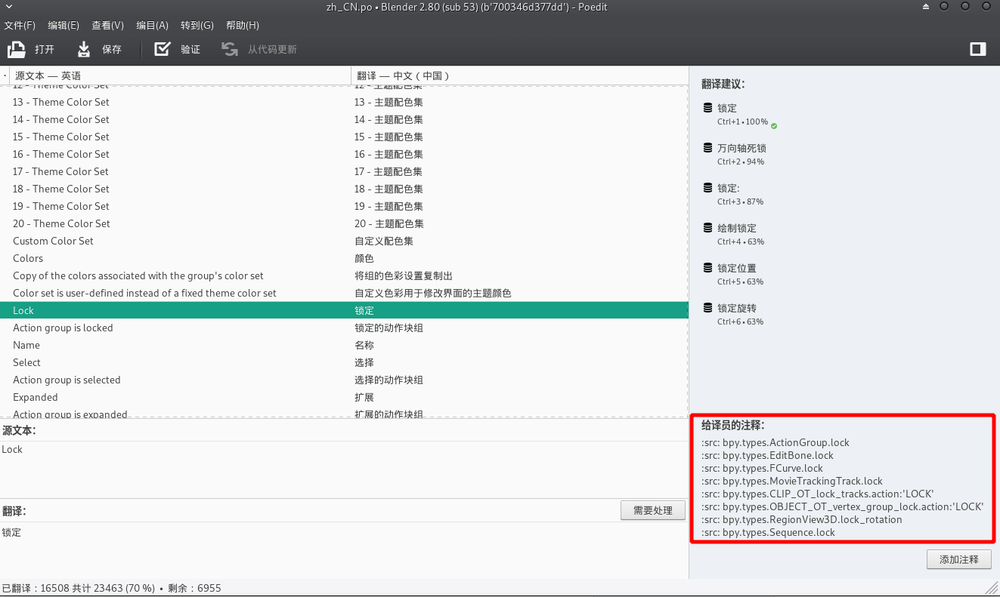

# 介绍

本项目意在以GitHub项目的方式维护Blender汉化文件。

~~在此之前，本人在百度贴吧开了一个[汉化报错帖](http://tieba.baidu.com/p/5530957667?pid=117496092864)。社区用户以回帖的方式反馈汉化的错漏，由本人统一维护提交。~~ (7/17注: 由于百度经常无故删帖，存在太多不确定性，汉化报错全部转移至GitHub。)

近期本人突然意识到可以尝试用GitHub协作的方式完成UI的汉化，使用issue讨论用词争议。所以，也就新建了这个项目。

欢迎Blender用户提交修改，提报issue。

---
2019/7/17 更新：

2.8版本界面更新了大量功能与界面内容，使中文界面的词条汉化比例由2.79版的82%骤降至72%。

2019/6/12 社区用户 **asx** 向官方提交了一个UI汉化的补丁，包含超过6000条修改。我在本地打上补丁后，发现其中存在大量(超过50%)错误与不当修改。不得已，我们拒绝了这个补丁，并提出在审核后向官方提交更新。至于后续的一些故事，请见开发[页面](https://developer.blender.org/D5066)。

2.8正式版发布在即，这次事件让翻译组意识到了中文用户对于汉化的急迫需求。我们在 `D5066` 补丁的基础上，对汉化文件进行了接手汉化以来最大的一次全面维护，修正了超过6000条补丁及原有汉化问题，耗时25天，赶在Blender 2.8 RC前提交了审核后的汉化文件。词条汉化比例由此提高到 **89%**。

RC发布过后，**deathblood** 加入了界面汉化工作，目前已提交超过700条汉化，汉化比例由此提高至**92%**。

由于本次汉化工作来的十分仓促，2.8正式版也将在月底发布，翻译组诚邀广大中文用户参与汉化排错。

## 关于汉化UI的原理

Blender 的UI是通过安装目录下的 `\datafiles\locale\zh_CN\LC_MESSAGES` 对应语言文件夹下的 `blender.mo` 二进制文件实现多语言本地化的。

而 `blender.mo` 文件则是由 `.po` 文件编译而成的。本项目中的 `/zh_CN/zh_CN.po` 文件同步自[官方UI翻译项目](https://svn.blender.org/svnroot/bf-translations/branches/zh_CN/)。

官方推荐使用[poedit](https://poedit.net/download) 修改 `.po` 文件。这是目前可以找到的最好的`.po` 文件修改工具。poedit还有一个好处是保存文件过后会自动编译`.mo` 文件，编译后的`.mo` 文件改名并[替换](https://www.jianshu.com/p/e6fdda5dd103)本地Blender安装文件夹下的汉化文件，就可以直接看到UI下的效果了。

## 汉化时应注意的问题

1. 汉化时需对照UI，汉化后替换本地 `blender.mo`，检查错误：
2. 注意一词多义问题

   **一词多义** 问题一直是Blender汉化的痛点。同一个英文词条，在不同语境下意思不同。但是除去官方对部分词条开特例进行了 **语境提取**，其他一词多义的词条只能通过一些折中的办法(两个意思都写上，保留英文等)来解决。

   一次多义情况下，可以通过poedit打开 `zh_CN.po` 文件后显示的 `给译员的注释` 来推测UI用到该词条的位置，进而作出合理的判断与修改。

   

3. 统一用词问题
   为确保界面词汇一致性，请新用户参考[对照表](./dict.md)统一用词。

   如对用词有争议，或新的见解，可开issue单独讨论。
   
4. 提交修改前，建议同时提报issue。

## 关于issue的提报

建议按照以下格式提报issue：

1）编辑器及模式：

2）具体界面位置(菜单/面板访问路径):

3）错漏描述及UI中英对照截图:

4）修改建议：

## 官方报错列表：

汉化过程中我们也发现了一些汉化文件中存在的翻译组无法处理的问题，下面是我们在跟进的几个bug tracker地址，有兴趣的可以去看看，并提交错误：

1. 一词多义：https://developer.blender.org/T43295

2. 词条缺失：https://developer.blender.org/T66844

3. 已有词条无法正常显示中文：https://developer.blender.org/T66731
